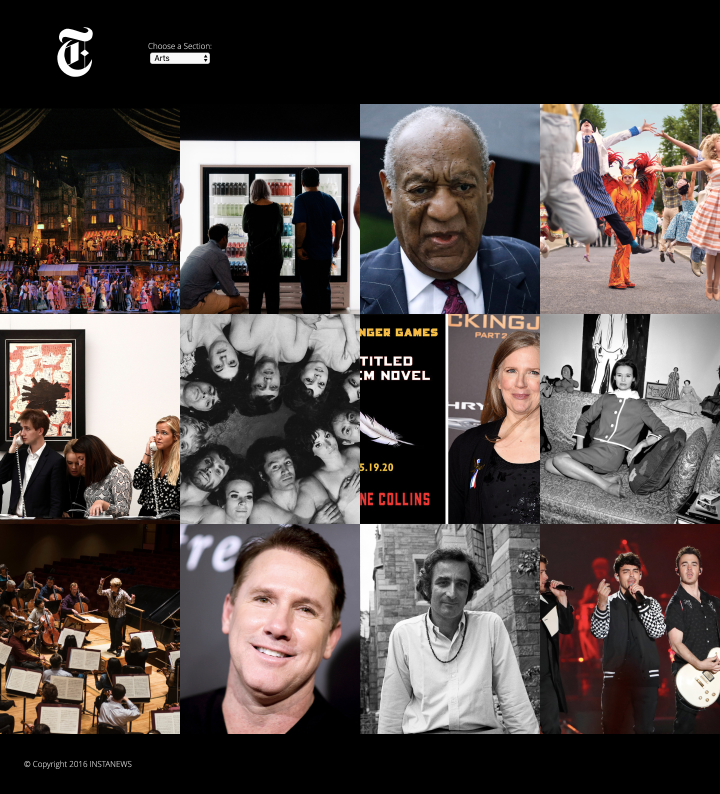
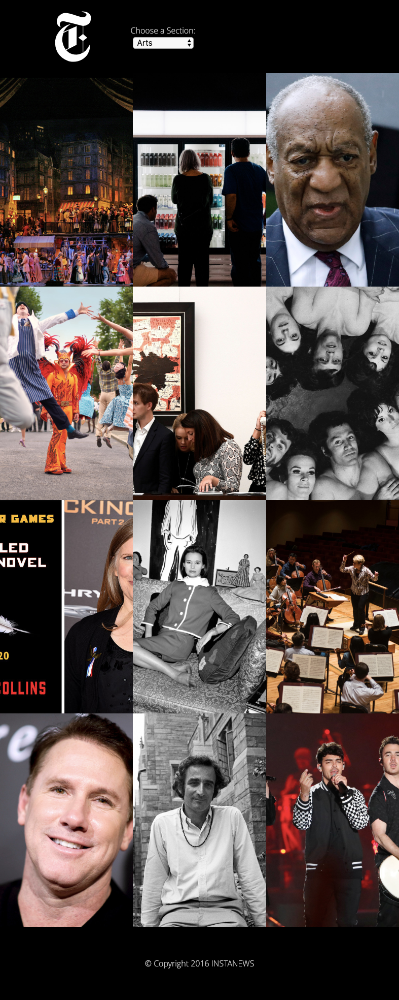
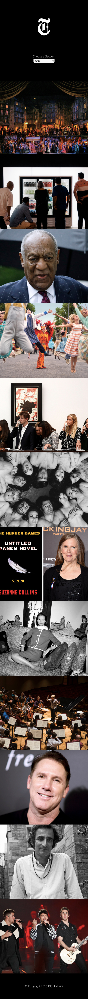

# Instanews App

A simply formatted webpage that pulls top stories of different genres from the New York Times database.

# Installation

## Setup

Clone this project and open index.html in browser.

# Technologies

* HTML5

* CSS

* JavaScript

* Gulp

# Personal Learnings

* Explored the use of Ajax for get json requests.

* Learned to install and run gulp tasks.

* Applying CSS grid is a more convenient solution for rearranging layouts in responsive web design. 

* Learned to convert css into sass files for better organized css.

# Screenshot

## Desktop

## Tablet

## Mobile

# License

This project is licensed under MIT 2019.